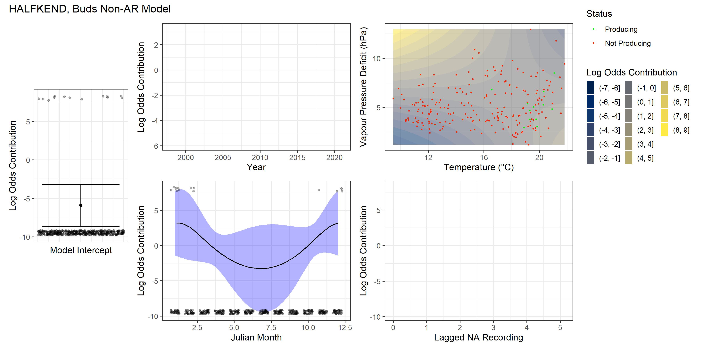
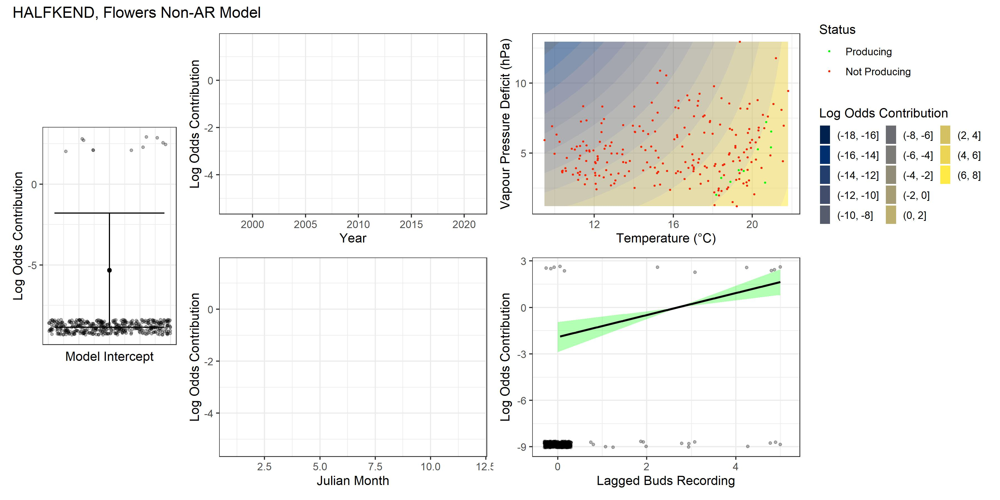
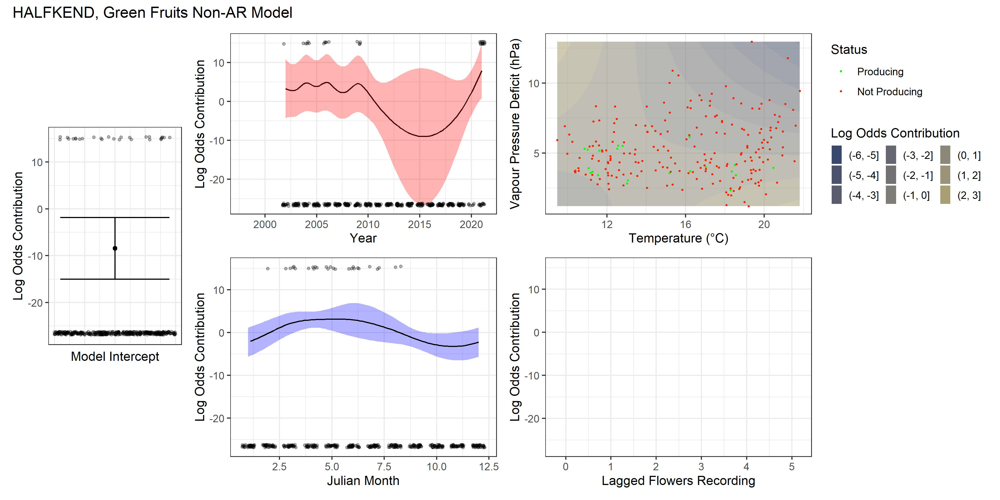
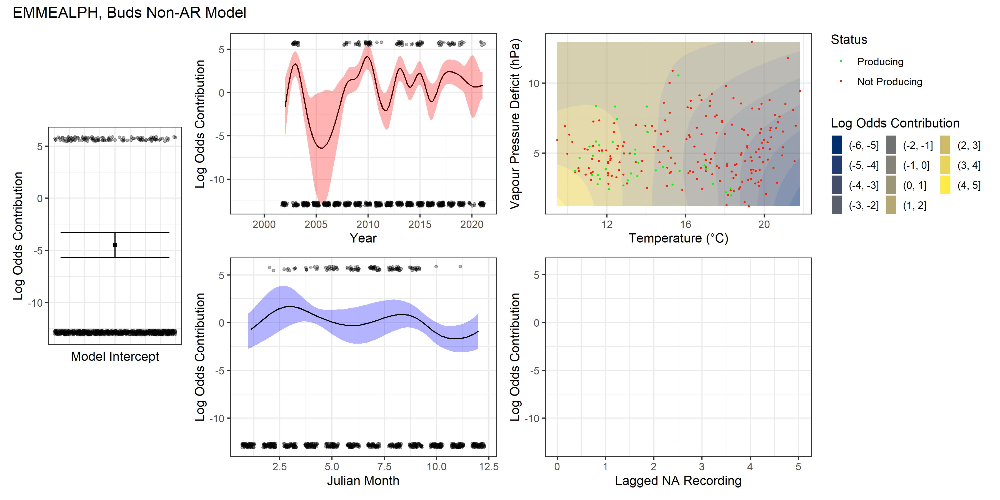
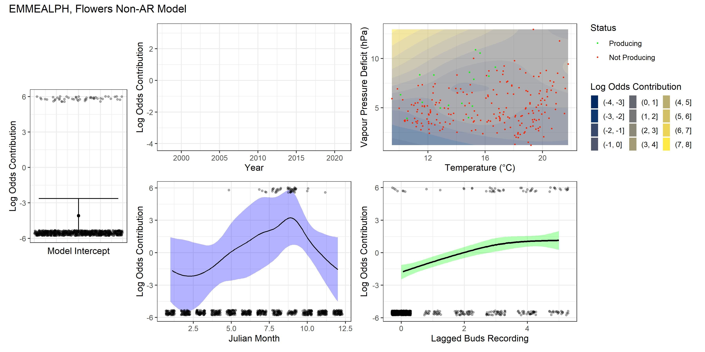
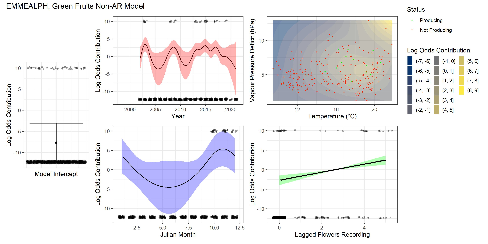
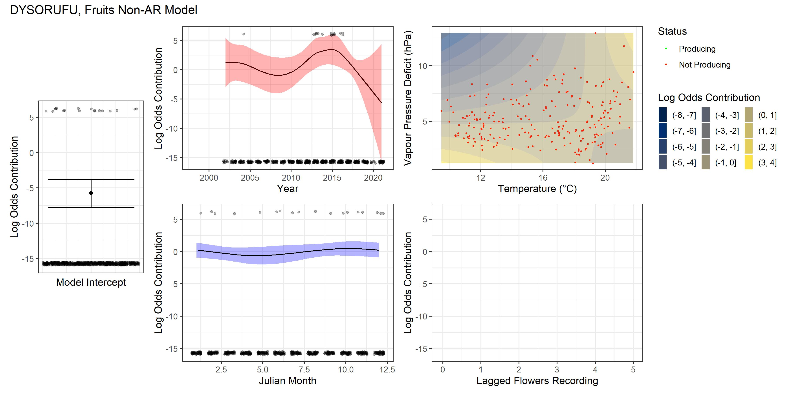
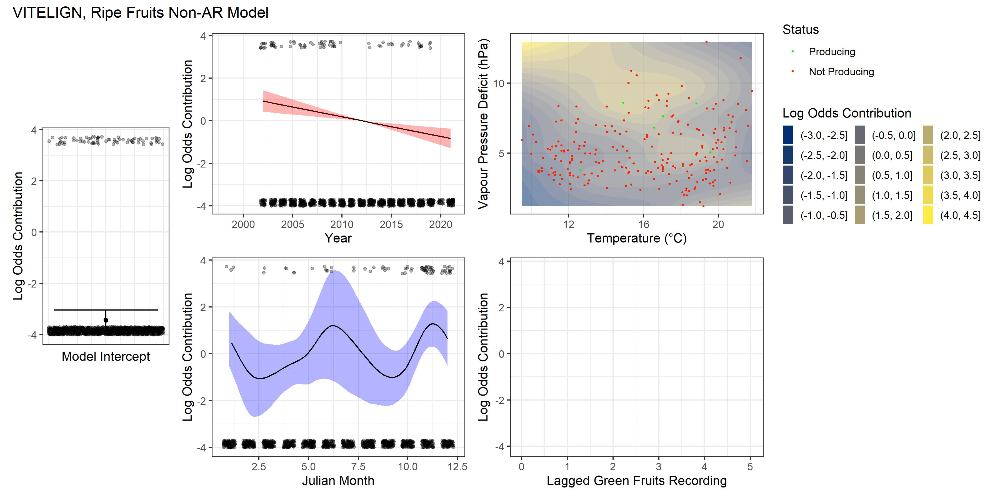

```{r setup, eval = TRUE, include = F}
library(knitr)
library(kableExtra)
library(tidyr)
opts_chunk$set(echo = FALSE)

#adjust this setting to cause script to generate plots anew. Takes a small wait
do_plots = F
source("plot_creation_script.R", local = knitr::knit_global())

```

## Introduction

Although some plant species have highly regular annual flowering and
reproductive patterns and intensities, for other species it is more
complicated. In both cases, this reproductive phenology has complex
relationships with environmental conditions, which, whilst understood in
general terms, thus far eludes wholistic mathematical modelling. In both
cases, this phenology is known to be greatly influenced by
prior growth and climatic influences, however the nature of these
relationships could be further elucidated and expanded to a greater
number of species. Whilst there does exist a growing body of long term
phenological research, there is still much need for such work in
Australia (Keatley et al, 2002). Understanding the patterns with which
trees reproduce is fundamental to our capacity to model rainforest
dynamics and safeguard ecosystems from future threats. By informing
prioritisation of resources and action, this understanding plays a role 
against dangers like anthropogenic climate change and land clearing.
Further, this knowledge aids in restoration efforts; knowing when seeds
are produced aids in collecting and spreading plants.

It is particularly challenging to predict reproductive patterns for masting or supra-annual tree species, whereby most trees in a population will lie relatively dormant for multiple years before synchronously flowering and hence fruiting. Further, there exist sub-annual seeding trees, which produce multiple crops each year, though these are significantly rarer. These seeding patterns are known to be impacted by variations in climate, altering reproductive in frequency, duration, and intensity. However, a more quantitative model of this relationship, especially one specific to Australian species, is sorely needed.

Generalised additive models are a burgeoning modelling technique that
are more flexible than the traditional generalised linear model, and
are very well suited to ecological data. In addition to studying phenology, 
this paper aims to 
spread awareness of this technique, and is intended partially as an
introduction to what is capable using it. It also introduces an 
uncommon variant with great ecological potential,
the Autoregressive Generalised Additive Model, but
fails in certain critical (and hopefully illustrative) aspects.

Data has already been collected monthly over a period of 23 years from over 150 trees from 41 species by human observation. The study location lies in the MacPherson Range, in Lamington National Park, and therefore falls within the UNESCO Gondwana rainforests (UNESCO, 1994). These forests represent highly important protected ecosystems and have ‘outstanding universal value’. By examining seed phenology in these sites, the acquired knowledge is directly applicable to a highly important system. 

## Background
One can separate trees into three categories: annual trees, have a reproductive 
cycle of one year, sub-annual trees, which reproduce more quickly, and supra-annual (also called masting) trees, which reproduce more slowly. This division is, of course, a simplification, and is not always useful, but it does illustrate the variations that exist in tree reproductive patterns.

Annual fruiting are far and away the most common strategy in rainforest tree communities (Kelly and Sork, 2002), but this does not mean that the reproductive periods of such species are not impacted by a variety of climate factors. Whilst reproductive patterns for these species are perhaps less complicated to predict than masting species, the phenological impact of climate change could still be further elucidated, especially quantitatively. The set of climate factors that can influence this phenology includes temperature and water supply (Law et al, 2000), but also solar irradiation (Chapman et al, 2000) and rainfall variability (Dunham et al., 2018), among other factors. These factors lead to species-specific changes in reproductive efforts in terms of duration, intensity, and timing.  Overall, annual fruiting species, by virtue of being common, are relatively well understood, but there are still many species for which a quantitative assessment of long-term data is missing.

Supra-annual or masting tree species, are relatively rare in most rainforest tree communities (Kelly and Sork, 2002) and are a highly polyphyletic group. The evolutionary drivers of this adaptation cannot be explained by any one hypothesis. Synchronous reproduction is driven by many factors, some significant examples are environmental prediction (Ascoli et. al, 2019, Burns, 2011), predator satiation (Wright, 2021), and pollen matching (Koenig et al., 2015). Which factors best explain masting behaviour ar known to vary by species, but this knowledge is still in development. There is a need for more long-term studies and modelling as key components in understanding in greater detail the factors that control masting, especially in an Australian context.

Sub-annual reproduction is extremely poorly researched, possibly due to inconsistent definition. The result of multiple fruiting seasons within a single year is inconsistent seasonal conditions for offspring. Althought there exist multiple hypotheses exist for what evolutionary benefit it conveys, such as that reducing competition for seed distribution (Schubert and Walters, 2021) or to support populations of seed distributors (Innis and McEvoy, 1992) or pollinators. However, the fruiting patterns of sub-annuals as a group are poorly documented. This project, by virtue of having data on  intra- vs inter-annual reproductive patterns, is well poised to elaborate on this poorly understood topic.

As a consequence of general pressures all trees are subject to, and the specific pressures associated with 'non-standard' phenology, the ways in which tree reproduction will be impacted by climate change are highly complicated. In addition to variations in overall reproductive intensity experienced by many trees, the reproductive window of masting trees is believed to be impacted in terms of frequency, interannual variation, temporal autocorrelation, and spatial synchrony. However, these impacts are poorly understood and species specific (Hacket-Pain and Bogdziewicz 2021). Variations in reproductive efforts of all trees will doubtless have impacts on tree population and community dynamics, and both flowers and fruits further provide food sources for many animals (with many animals changing diets during masting periods (Connell, Green, 2000)), the effects of phenological change due to climate change could be widely felt.

This study is impressive in scope in both the duration and the number of species and individual trees sampled. Masting trees in particular benefit from this long study duration. As these trees can go without reproducing for many years, shorter studies can miss reproductive windows entirely, or only contain very few reproductive events, making statistical analysis from shorter observation periods difficult and low power. Further, the powerful GAM techniques allow for flexible, accurate modelling that is more sophisticated than many other examples in the field. Whilst the scope of this study is too large for a detailed examination of every model, this study still aims to demonstrate a workflow for analysis, and the information that can be gleaned through decomposition of reproductive trends into interannual, intraannual, and climate components

## Methods

### Study Location

The study location was a plot in the MacPherson range in the suburb of
O'Reilly's in South-East Queensland, Australia. The plot is owned by the
University of Queensland. The plot is approximately 1500 m^2^, at an
altitude of 950m, with latitude and longitude (28.2223°S, 153.1248°E).
Forests one kilometer away were determined by the Queensland state
government to be of the type 12.8.5 in the Regional Ecosystem
Classification system (corresponding to Complex Notophyll Vine Forest)
(Jones 2017). The plot consists of dense subtropical mountainous
rainforest and has been the site of observation for the full 23-year
study period from 1998 to 2021.

### Data Collection

The data were collected primarily by Bill McDonald, with some earlier
collection by Peter O'Reilly. This consisted of monthly visual surveys from the
forest floor, with binoculars used where necessary. Flower bud, flower,
and green and ripe fruit quantities were individually assessed on an
arbitrary scale from 0-5. Trees with no visible flowers for example,
were given a score of 0, whilst trees with very large crops were given a
score of 5. Notably, the rate of false negatives was likely higher for
lower scores, as scores of 1 or 2 were more likely to be miscategorised
as 0 than higher scores. Partially for this reason, and also because it
greatly simplify the models, the data were reduced to binary data when
treated as response variables, such as flowering or not flowering. Trees
were considered to be flowering when the recorded value was greater than
or equal to half of the highest recorded score for a given species of
tree. This enables species that never recorded a '5' on the subjective
scale to be analysed.

Individual trees were initially marked and then monitored during each
survey. Monitored trees that died were replaced with a tree of the same
species and a similar size. Further, more trees were added during the
duration of the study. 95 trees were initially surveyed, and 152 trees
were included in the final year of analysis. Over the course of the
study, data were collected from 41 different flowering tree species.

Although the data were collected as ordinal categorical data (the data
consists of discrete categories that have order but no well defined
relative size or significance) they have been reduced to binary data,
such as flowered or not flowered, for the purposes of statistical
analysis. This greatly simplifies the models

Climate data, in the form of temperature and vapour pressure deficit
(VPD), were accessed through the ANU Climate 2.0 project (Hutchinson et.al 2006),
which uses spatial interpolation of climate data collected from 300 to
700 stations operated by the Australian Bureau of Meteorology around
Australia to estimate climate data on a 0.01 degree latitude/longitude
grid.

### Statistical Analysis

#### Generalised Additive Models

Traditional Generalised Linear Models (GLMs) are a staple of statistical
analysis in a variety of fields, capable of modelling many phenomena
whilst remaining very interpretable. The heart of GLMs is a simple
linear function of dependent variables that is transformed. The result
of this transformation is fed as a parameter determining how the
response variable is distributed. For less experienced readers,
McElreath. 2016, and Quinn, G. P., and M. J. Keough. 2002. function as
strong introductions.

Formally, if the probability $p$ that a tree is a blooming is modeled by
a vector of dependent variables $\textbf{X}$ using a GLM, at the i^th^
data point it obeys the formula:

$$
g(p_i)    =    \textbf{X}\beta_i     =     \beta_0 + X_{1i}\beta_1 + X_{2i}\beta_2 + X_{3i}\beta_3+...
$$ Where $g$ is the log odds function and $\beta$ is a vector of
coefficients for each dependent variable. GLMs are a very effective tool
for many systems, however, they are not always appropriate. The linear
function at their core is ultimately a strong assumption that leads to
many systems being poorly characterised by GLMs.

Generalised Additive Models (GAMs) are an extension of GLMs, where
rather than using a transformed linear function of dependent variables,
dependent variables are fed into a set of smooth (continuous) functions
that are added together. This sum is used similarly to the linear
function in GLMs, being transformed and used as a parameter for the
distribution of the response. $$
g(p_i) = f_1(X_{1i})+f_2(X_{2i})+f_3(X_{3i},X_{4i})+...
$$ There are a number of serious mathematical problems introduced by
GAMs, however, the machinery is built into most GAM packages in R
(notably *mgcv*, *brms*, and *gamm4*, amongst others), and the average
user need not concern themselves with the majority of it. For those
interested, the canonical GAM text is Simon Wood's *Generalized Additive
Models, An Introduction with R*, a very thorough theoretical treatment
of GAMs, and is recommended for any interested readers. Simply, each
smooth function has values determined by a basis of spline functions.
The model optimises for which combination best fits the data, with a
penalty for 'wiggliness' applied to the second derivative to avoid
overfitting. GAMs are an effective tool to meet many problems,
sacrificing relatively little interpretability for significant
improvements in fits. However, the literature for GAMs is much shallower
than for GLMs. As a consequence, the existing toolbox for models is not
quite as broad as that for GLMs.

#### Autoregressive Models

Autocorrelation is a property of time series whereby terms are
correlated with prior terms. An important model in economics and other
areas of statistics is the autoregressive model, AR(p), which models a
time series where the value at each step is a linear function of the
previous p steps plus some random noise. $$
X_i = \alpha_1 X_{i-1}+\alpha_2 X_{i-2}+...+\alpha_p X_{i-p} + \epsilon_i
$$ GLMs and GAMs, as statistical models, have error terms as important
components. One significant assumptions of both of these categories of
model is that the errors are independent and identically distributed.
However, there exist many cases where this assumption isn't met. In
particular, when model errors are temporally autocorrelated, estimates
for errors will be biased and fit will be poor (Rij 2016, Baayen Et. al 2016). Although
often this problem can be resolved by changing model specifications, for
example, adding the parameter by which the autocorrelation is mediated,
sometimes this is not possible. When this is the case, it is sometimes
useful to have models where the errors are constructed as per an AR(p)
model. In the case of a GAM with AR(1) (AR-GAM) errors:


$$y_i = p_i + \epsilon_i $$

$$g(p_i) = f_1(X_{1i})+f_2(X_{2i})+f_3(X_{3i},X_{4i})+... $$

$$\epsilon_i = \rho \epsilon_{i-1} + \omega_i \\$$

$$\omega_i \sim \mathcal{N}(0, \sigma) $$

There exists some significant exploratory work for temporal (or spatial)
AR-GAMs as useful tools for modelling a variety of processes (Baayen et Al. 2016) providing significant benefits both in terms of fit
quality and resolving issues from poorly meeting model assumptions. It's
notable that AR-GAMS are significantly less interpretable than GAMs.
This is because AR effects function to dampen the size of and confidence
in the effects of dependent variables. This is partially due to
autoregression functioning to explain the variance of the model without
the need for variables. Informally, if a tree blooms more in the summer
months, in the second month it's less clear if the tree is blooming
because the weather is warm, or just because the tree bloomed last
month. However, the significantly improved fit, and the better adherence
to model assumptions are very valuable. For this reason however, both AR
and non-AR GAMs are presented in this paper.

It is notable that there are relatively few papers in ecology where
AR-GAMs see use. This is despite the fact that it is easy to imagine
strong biological reasoning behind the inclusion of autoregressive terms
in many systems. In this paper, for example, flowers present in one
month are likely to correlate with the presence of flowers in a previous
month, trees often flower for more than one month. This relative dearth,
then, is attributed by the author more to the complexity of the models
and their relative obscurity, than to their appropriateness.

There is however, a significant problem with using AR-GAMs for the
purpose of this model. As there are relatively few R methods available
that can process GAMs at all, these models can be created with
relatively few package options. Further, many of the diagnostic criteria
that GAMs use are constructed around gaussian data or gaussian errors,
such as k-check (Wood, 2018), residual checks, and pseudo-quasi likelihood
estimation. For some methods, this extends to the point of making them
statistically inappropriate, such as the highly popular *mgcV::gamm*
function. Even though it is one of very few functions that can handle
AR(p) models with p\>1, it's use of PQL estimation is deeply
inappropriate for data with non-gaussian errors, like binomial data.
*gamm4* can handle binomial data very well, but is incapable of handling
AR models of any degree. For this reason the function *mgcv::bam* was
selected, primarily due to models running more efficiently than
alternatives like *brms*. This does create two limitations: 1) *bam* can
only optimise AR GAMs using a variant on Restricted Maximum Likelihood
(REML) called fREML (fast REML), which cannot be used on GLMs, making it
impossible to directly compare the models with any GLMs, and 2) the
models are limited to AR(1) only. This second restriction is shared by
all other methods that can be used on binomial data, and is a
consequence of the residual structure (Modrak, 2021). A lesser consequence of this restriction is that the optimal
value of $\rho$, being the coefficient with which previous errors
propogated to future errors was selected using model comparison
techniques, as it could not be optimsed for directly.

### Model Structures

The data collected consisted of temporal data, the response variables,
and climate data. Many possible models could be constructed from
combinations of these factors. Lacking a priori expectations for which
factors play a role in each aspect of the reproductive cycle for each
species, many models were tested and compared to find which model best
fit the data. This comparison was performed using the *compareML*
function from the package *itsadug*, which compares (in this case) the
fREML and the effective degrees of freedom (Edf) of a pair of models.
fREML, as a form of maximum likelihood estimation, assesses the degree
to which the data are likely to have arisen having assumed the model. A
lower fREML corresponds to a model that better fits the data.
(Wood 2017) Edf is a measure present in GAMs that approximates
traditional degrees of freedom (which is not a useful measure of GAM
systems), and hence expresses the complexity of a given model.
*compareML* preferences models of better fit if the model is equally or
less complicated, but otherwise uses a $\chi^2$ test to assess if the
difference in fREML is significant given the difference in Edf. 

This method of model selection is one of many potential options. It is considered to be preferable for within model selection to other criteria when AR(1) models
are involved; AIC in particular is highly flawed (Rij, 2016 b). However, fREML, as a variant of REML, is 
also strongly discouraged for comparing models with differing fixed effects. (Faraway,2006) 
**Whilst the results will to some extent still be meaningful, the overall validity of the fundamental fixed effect selection
criteria used in all statistical models in this paper is highly questionable.** 
There are two alternatives that could have been used: All models could have been constructed
with the maximal fixed effect structure, following which models could be examined graphically,
with terms tested for model significance in a reiterative fashion. This is an attractive
option for simple modelling, however becomes prohibitively slow as the number of models 
created increases. 210 models is likely outside of the reasonable realm for testing. Alternatively,
other reference criteria can be used for model comparison via methods like compareML. Whilst fREML 
is the only model comparison technique that can be used on non-gaussian AR GAMs by bam and the mgcv
package, brms or other packages could potentially use other model comparisons metrics.
Maximum Likelihood could potentially be implemented for non-gaussian AR GAMs.
Bayesian optimisation could likely resolve the issues that fREML was necessary
to solve in bam in order to make computation tractable. This would, however,
introduce new problems related to prior selection, and result in a significant increase in computational resources required.

It should be noted that, in addition to more complicated models being
penalised in terms of Edf, more complicated models can also suffer from
the problem of concurvity. This is analogous to the problem of
multicollinearity in (G)LMs; when one dependent variable is correlated
with another, and hence, can be approximated linearly by it, the model
is overspecified, and standard errors are inflated. This is
because the model can capture the effect of the first variable by either
assigning it a coefficient, or by increasing the coefficient of the
second variable by a proportionate amount. This problem is heightened in
GAMs, where the same problems arise if one dependent variable can be
modeled with any smooth function of a second dependent variable. It
arises for similar reasons, and leads to similar problems of inflated
errors. (Wood 2017) For example, in this model, the primary
concurvaceous variables are the month within the year (also called the
Julian month) and climate. Because climate can be effectively modelled
by the month of the year, models including both variables have inflated
errors. This is reflected in the fREML values of these models, however,
to reiterate, the validity of comparing fREML of models with differing
fixed effects is questionable.

Models were constructed using as response variables the presence of
buds, flowers, green fruits, ripe fruits, and fruits in general. Notably
fruits in general were considered present when either ripe fruits or
green fruits were available. The dependent factors used in the models
were as follows: year, Julian month, temperature, VPD, antecedents and
the identity of the individual tree from which the data was sampled.

Year was presented as either a simple parametric linear component, or as
a smooth spline. Temperature and VPD were presented as a single tensor
spline representing climate (This accounted for the effect of each
variable, as well as their interaction). Julian month was presented as a
cyclic spline such that the value in December was continuous with the
value for January. The antecedents (being the prior reproductive
component score from the previous month, left on a scale from 0-5)
varied depending on the response variable of the model. Buds had no
antecedents, but flowers used a spline of buds, fruits and green fruits
used a spline of flowers, and ripe fruits used a spline of green fruits.
Finally, the individual tree identity was treated as a random intercept
of the model.

Models consisting of the all subsets of the above factors were created
for each species of tree, with two restrictions. The Julian month spline
was only included in models that contained the climate spline. As Julian
month could be used to predict the climate (i.e there existed
significant concurvity between the two variables), it was possible that
the effect of climate (and hence, potentially, anthropomorphic climate
change) could be hidden in the Julian month spline. That is, a model
containing the Julian month spline could be selected over one containing
the climate spline, even though climate is impacting the response
variable. Secondly, models that contained no splines, only parametric
factors (null models and the model containing only the parametric year
term), were discarded. This was because the bam function automatically
considers these models GLMs, meaning they cannot be optimsed with fREML,
and thereby cannot be compared with the AR GAMs (however, for
consistency, these models were also not compared to the non-AR models).
The GAMs were compared using *compareML*, and the best model for each
species was found. This process was run independently for both AR(1) and
non AR models.

## Results

AR and non-AR GAMs were created for all 41 species present in the data,
as well as global models using all tree data. Whilst individual models
are complicated mathematically, they are graphically comprehensible,
leading to a high overall interpretability. Models were pulled from a
wide sample set of possible models, resulting in models with different
terms for different species. As predicted, in general, AR models were
less complicated, with lower effective degrees of freedom and less model
terms. (see Table 1)

Unfortunately it impossible to state conclusively if the AR models
more, or less effectively modeled the data. Naïve model comparison by fREML
and Edf testing is strictly speaking inappropriate between models with differing fixed effects,
and simple measures of fit are either not appropriate for non-gaussian GAMs 
(such as R^2^ (Rij 2016 b)), or for AR models (such as deviance explained: 
Many AR models returned a negative percentage of explained deviance). Finally,
visual assessment of fit is difficult due to it's dependence on residuals,
which are only visible on the response scale of probability, not the the
link scale of log odds. The response scale is difficult to represent due to the high
dimensional data and the non-linear transform from link to response. 

However, even without fREML (which may still have some qualitative value),
the non-AR models can be assessed to some extent, both graphically, where they 
can be qualitatively assessed on a log odds scale, and in terms of deviance explained,
which is a valid measure of fit for many, but not all models.


```{r, echo = F, results = 'asis'}
table_1 <- kable(averages, align = 'rr',digits = 2,format = 'html',
                 caption = "Table 1: Table of Summary Parameters for Autoregressive and non-Autoregressive GAMs") %>% kable_styling(bootstrap_options = c('striped','hover'))

table_1
```

A consequence of the reduced number of model terms in AR GAMs is that
the effect of these variables on reproductive patterns is poorly
explored. By observing plots of splines, temporal structures,
reproductive patterns, and climate structures can be qualitatively
observed. However, for example, only 23% of AR models contained the
climate spline as a predictor. By contrast, 100% of the non-AR models
constructed utilised the climate spline, enabling ready understanding of
the impact of this important climate factor. It should, however, be noted that the fact that the climate spline is missing from some AR models would not be without significance (were the fixed effect selection criteria valid), especially in terms of prediction.

Other notable trends in factor inclusion include the fact that the tree random intercept spline was
found to be insignificant in every model, implying that, on average, all
individual trees of a species sampled reproduced at similar base rates.
An extension of this model might include so called factor smooths
(functioning as equivalents to slope random effects in GLMs) which
enable smooth terms like the climate or year splines to vary with
factors. These factor smooths were excluded from these models due to the
increased computational burden.

Another way in which models varied was in the selected $\rho$ value. The
majority of models selected strongly AR(1) correlated errors, with
almost all models selecting the maximum allowed $\rho$ value of 0.99
(it might be noted that the $\rho$ selection process, which optimised for
rho internally for each potential model was a valid process as the fixed
effects were unchanged between models of varying $\rho$ value).
However, of the 12 out of 210 models that did not have a $\rho$ value of
0.99, all selected a $\rho$ value of 0. In principle, this should result in an
equivalent model to the non-AR case. However, this often failed to
arise. Seven out of the twelve 0 rho valued AR models have fREML and Edf
differences from their non-AR counterparts such that a $\chi^2$ test
strongly prefers one model to another.

![*Figure 1: Example model plot (showing *Acronychia pubescens *non-AR flower model). The y-axes (of the 1-dimensional plots) represents the contribution to the overall log odds prediction of  the probability of recording that the tree is flowering at a given time. Colours of the contour graph are scaled relative the y-axes of the 1-dimensional plots. Blank plots indicate that a given factor has not been selected as a part of the model. Plots consist of the intercept of the model when other terms are at median values (far left), the year contribution (top left), the climate contribution (top right), the month contribution (bottom left) and the contribution of prior reproductive components (bottom right). Overall probility predictions are given by transforming the sum of the y values for all included factors at a point. Points represent the recorded data, presented above or below the plot for presence or absence for 1D plots, and in green or red for contour plots.*](outputs/graphs/ACROPUBE_Flowers, non-AR.jpeg)


Models are presented as single figures (generated using the *gratia*
package) containing plots of all component factors, as well as estimates
for the intercept of the model. Figures are presented on a log odds
scale. Whilst this does mean that the probability of blooming cannot be
directly observed, it does represent the true relationship between the
multiple plots in each figure. Each figure is presented on a consistent
y-scale, and summing the estimates for a given point on all included factors
provides the model estimate for that point. This sum ($\Sigma$) can be transformed into a predicted probability p. Where *e* represents Euler's number:

$$
 p = \frac{e^\Sigma}{1+e^\Sigma}
$$


The values of the contour
plot are difficult to compare directly with those of the 1-dimensional
splines, however, the colour scaling has been set such that colours at a
given point are determined relative the size of the y axes in the
1-dimensional plots. As a consequence, contour plots with larger colour
differences represent models where the effect of the climate spline is
greater *relative the sizes of the other sources of variation*, whereas
the opposite is true for more uniform contour plots. 1 dimensional plots
contain 95% confidence intervals, generated using the *gratia* package.
The data are represented on all plots. In the case of 1 dimensional
plots, they sit above or below the smooths representing having bloomed
or not blooming respective. Note that as the plots are on a log scale,
the y-values of these points cannot be interpreted meaningfully. The
data points for the contour plots are presented with colour, with
blooming and not blooming represented in green and red.

The plots for the majority of the data are not present in the main body
of this paper, due to size constraints from 420 distinct models.
Instead, see appendix A for the complete set.

## Discussion

It is unclear to what extent the flaws in fixed effect selection invalidate
the conclusions that can be drawn from the plots they have generated, however,
the methods by which these plots can be understood, the ways in which temporal,
climate, and reproductive patterns can be discerned will be applicable to
the outputs of similar models that can be constructed using more statistically valid methods.


Structural trends are best observed from the set of non-AR models. Although
portions of the structure of contours in AR GAMs often reflect the
analogous structure in non-AR GAMs, the effects are weaker and harder to
distinguish from other spline regions and splines structures are often not present
that are present in non-AR models. The presence of more splines also enables
a visual assessment of the relationships that exist, even with the invalid
fixed effect comparison model selection

Important to recognise in searching for patterns is the relationship between
the models of a given reproductive structure and it's antecedents. For some species,
fruit patterns are dependent on the prior values of flower recordings, whilst for other
species this is not the case, fruit quantities are more strongly associated with other 
factors, like the year or climate. In the former case, if the flower presence is not strongly associated
with the year, one interpretation might be that flowers are produced in every year, 
but only in some years are the conditions such that these flowers are pollinated and 
produce fruits. An example of a pattern like this can be perceived in the fruits model
for the species *Halfordia kendack* (Figure 2) and it's relationship to flowers.
This said, it is quite possible that
the way that the model encodes lagged values could be more flexible. At present,
the only lagged values present in any of the models are the values from the previous month, however,
for for *H. kendack*, there is a strong pattern of buds occurring in the summer months, 
a strong pattern of flowers following buds,
a significant pattern of green fruits occurring from autumn to winter, and a strong
pattern of ripe fruits occurring in late winter and spring. This trend could potentially be
captured, therefore, by a month spline for buds, and then a lagged spline on the order of 3-6 months
for green fruits, and on the order of 3 months for ripe fruits.


 
 
 


However, when antecedents are an important
part of the model, the factors which are significant for the antecedents can play a role
in the structure presence even when they are not directly significant. For example, 
whilst *Emmenosperma alphitonioides* fruit are not strongly associated with the month
within the year, they are very strongly associated with the recording for flowers from
the previous month, and these flowers almost exclusively occur in the spring months. (see Figure 3)

 
 
 

*E. alphitonioides* also functions as an example of strong climate structures.
In addition to all structures containing a strongly significant year spline,
the buds are present mostly from autumn to early spring, and are significantly more likely in
colder periods. The flowers are strongly associated with the previous existence of buds,
and but are more likely to have bloomed in the start of spring when the conditions are dry,
being strong penalised in likelihood at lower vapour pressure deficits.
Finally, general fruits are associated with prior flowers, but are somewhat
more likely to occur when conditions are warmer. With further specificity,
the transition from flowers to green fruits does not strongly require any
climate, although it was somewhat more likely at middling temperatures and vpds,
whilst these fruits ripened most commonly when it was warmer during winter months.

The other major set of qualitative trends present in the models are the
temporal structures of the month and year components. Concepts of annual,
sub-annual, and supra-annual reproduction should in principle be represented
in both the graphed data as well as in the temporal splines. However, in a 
corrected model set, this should be verified with external knowledge about
the fruiting patterns of the trees in question.

Interannual structures, in the form of the year spline, may be associated
with masting or supra-annual reproduction, especially when they are sizeable
and strongly non-monotonic. The majority of fruit splines do not contain these structures, but a significant number do. However, *E. alphitonioides* demonstrates possible difficulties in interpreting interannual temporal structure.
Whilst all reproductive structures other than
flowers contained significant year splines with sizable effects, the buds 
spline peaked in 2003, 2010, 2013, 2015, and 2018 whilst the general fruits spline
peaked in 2003, 2009, 2016 and 2021. As fruits are related to buds, the overall
effect of a given year is hard to interpret, but it is puzzling to a naïve interpretation that fruits should peak before flowers. 
For this reason models without antecedents might be more appropriate for exploring certain trends.
For example the *Dysoxylum rufum* fruit model has not selected any flower splines and shows a strong supra-annual fruiting pattern,
fruiting almost entirely from 2013 to 2016, as fruiting was also influenced by climate variation (but relatively little by month), it is possible that this represents an example of environmental prediction, however, this is far from guaranteed.



Even for fruits with significant interannual splines it is difficult to make strong
statements about masting patterns from the data available. Obviously this is 
influenced by the invalid model selection process, but it is also the case that
masting patterns can be influenced by many factors that are not present in the data. It is known that masting is a polyphyletic adaptation associated with many strategies, such as predicting environmental change, satiating predator populations, and pollen matching, but assessing which of these strategies are being utilised by the trees that contain strong year splines is a process that requires a closer examination of the species in question. For example, understanding the impact of the *D. rufum* masting event on the population of it's predators requires an appropriate study of the predators of *D. rufum*.

There do exist a small number of species with splines that are strongly suggestive of sub-annual reproductive patterns. A prime example being *Vitex lignum-vitae*, which contained two distinct fruit ripening periods, one in winter and the other in late spring. Whilst there do exist a number of trees that reproduce in patterns that aren't dependent on month directly, or that fruit throughout the year, very few have multiple such well defined discrete windows. Identifying in a graphical fashion these sub-annual trees could be a useful step in identifying and studying this poorly understood phenomenon.



The models for which rho was selected to be 0 were quite heterogeneous
in terms of fREML and contained splines. 
These 0 -$rho$ models should, in principle, be identical to their non-AR
equivalents. In some cases this occurred, with either identically
selected models (such as the GUIOSEMI flowers model) or models that
cannot be distinguished by $\chi^2$ tests (such as the HELIGLAB green
fruits model. Recall, however, that this is a flawed measure).

```{r, echo = F, results = 'asis'}
table_2 <- kable(rho_0_models[,1:8], align = 'rr',digits = 2,format = 'html',
                 caption = "Table 2: Table of the models that have a rho value of 0. Comparing fREML values should be done with care, however, these very large differences are almost certainly significant.") %>% kable_styling(bootstrap_options = c('striped','hover'))

table_2
```

However, there were cases where the non-AR model was
significantly different from the AR model with $\rho$ equal to 0. This
could potentially be a consequence of the fact that the binary testing
of *compareML* is not strictly transitive. A set of three models can be
constructed such that their differences in fREML and Edf are such that
even though models A and C are significantly different, A is not
significantly different from B and B is not significantly different from
C. Depending on the order of testing (and whether or not B is tested),
this can result in vastly different model estimates (such as the
ACROOBLO ripe fruits models). Potentially more likely, however, this could 
be a consequence of the invalid model selection process.

There is significant room for improvement in these models. The primary problem is the fundamental statistical invalidity of the fixed effect model selection process due to inappropriate usage of fREML, but there are other aspects that could be improved.

The inability to assess AR GAM fit directly will remain even in models that
appropriately use ML optimisation. Whilst ML will be able to compare e.g
different models for *Argyrodendron actinophyllum* fruiting, they will not be able
to compare these models with another species, and ML remains an ultimately 
relative measure. Something equivalent to deviance explained or R^2^ would be 
helpful. One potential avenue to explore is the use of the *DHARMa* package
(or another simulation package) 
which can be modified to simulate arbitrary model structures, and hence provide
assessments of fit such as remaining autocorrelation, residual distribution, and
dispersion. These useful measures from GLM analysis would be really helpful, but
are not currently supported for AR models. 

The set of possible factor splines could be expanded: the inclusion of factor smooths for individual trees could better express differing fruiting patterns between individuals, and lags from durations other than one month could capture trends that take place over slower periods, e.g. in trees where the process of flowers turning to fruits takes longer than one month. Another potentially helpful spline might be the interaction of climate and year. Whilst, as a 3D spline, representing this data becomes even more difficult, this could aid in untangling the effects of climate on masting patterns in different species.

One present flaw in the workflow is that final analysis of tree reproductive patterns is reliant on a great deal of human interpretation and visual inspection, producing results of questionable consistency and requiring significant labour for larger datasets. However, simplifying trends with more appropriate factors could aid in this process. 


## Conclusion

AR GAMs and non-AR GAMs are complimentary as modelling techniques. The
benefits of AR GAMs as superior fitting models, if realised, is in some sense obvious.
As models that in principle better model the data, more simply, they have
an obvious appeal both in terms of understanding the behaviour of a
system and potentially predicting future changes (although it should be
noted that year splines should only be extended beyond the study
interval with caution). However, the complex residual structures of AR
GAMs, coupled with their tendency to regress arguably relevant terms
away makes it difficult to assess the effect that changing these terms
may have. For this purpose, non-AR GAMs are likely better suited. By
exploring both options, a more wholistic understanding of the system is
hopefully reached. For a deeper discussion of the goals of modelling,
see Shmueli, 2010.

However, despite advantages, until AR GAMs achieve mainstream
usage, and develop a broader set of tools for their analysis, their
utility is frankly questionable. Even whilst there is strong biological
motivation in many systems, there exist many possible pitfalls for the
average user, and very little established work in the field to guide them. Once
made, assessing the success of a model is very difficult. More work needs to be
done to develop these techniques.

This said, the general workflow does show promise. The non-AR GAMs have been demonstrated to be quite 
capable of producing clear, highly interpretable graphs that can give insight 
into complex behaviors, although a strong external understandings of the system 
is strongly recommended to ensure accurate interpretation. 

## Acknowledgements
The author is deeply indebted to John Dwyer, Bill Mc Donald, Simon Wood, Gavin Simpson, and my late Mother

## References

M. Hutchinson, J. Kesteven and T. Xu. (2006). ANU Climate 2.0. NCI Australia. Retrieved December 12, 2022, from https://portal.ga.gov.au/metadata/australian-national-university-anu-climate-gh70-v2/ 

UNESCO World Heritage Centre. (1994). Gondwana Rainforests of Australia. Retrieved October 17, 2022, from https://whc.unesco.org/en/list/368/

Polansky, L., & Robbins, M. M. (2013). Generalized additive mixed models for disentangling long-term trends, local anomalies, and seasonality in fruit tree phenology. Ecology and evolution, 3(9), 3141–3151. https://doi.org/10.1002/ece3.707

Keatley, M.R., Fletcher, T.D., Hudson, I.L. and Ades, P.K. (2002), Phenological studies in Australia: potential application in historical and future climate analysis. Int. J. Climatol., 22: 1769-1780. https://doi.org/10.1002/joc.822

Koenig, W.D., Knops, J.M.H., Carmen, W.J. and Pearse, I.S. (2015), What drives masting? The phenological synchrony hypothesis. Ecology, 96: 184-192. https://doi.org/10.1890/14-0819.1

Ascoli, D, Hacket-Pain, A, LaMontagne, JM, et al. Climate teleconnections synchronize Picea glauca masting and fire disturbance: Evidence for a fire-related form of environmental prediction. J Ecol. 2019; 108: 1186– 1198. https://doi.org/10.1111/1365-2745.13308

BURNS, K.C. (2012), Masting in a temperate tree: Evidence for environmental prediction?. Austral Ecology, 37: 175-182. https://doi.org/10.1111/j.1442-9993.2011.02260.x

Wright, B.R. (2022), Evidence that predator satiation drives reproductive synchrony in the desert masting grass, soft spinifex (Triodia pungens). Austral Ecology, 47: 380-391. https://doi.org/10.1111/aec.13119

Hacket-Pain, A., & Bogdziewicz, M. (2021). Climate change and plant reproduction: trends and drivers of mast seeding change. Philosophical transactions of the Royal Society of London. Series B, Biological sciences, 376(1839), 20200379. https://doi.org/10.1098/rstb.2020.0379

Connell, J.H. and Green, P.T. (2000), SEEDLING DYNAMICS OVER THIRTY-TWO YEARS IN A TROPICAL RAIN FOREST TREE. Ecology, 81: 568-584. https://doi.org/10.1890/0012-9658(2000)081[0568:SDOTTY]2.0.CO;2

Iler, A. M., & Inouye, D. W. (2013). Effects of climate change on mast-flowering cues in a clonal montane herb, Veratrum tenuipetalum (Melanthiaceae). American Journal of Botany, 100(3), 519–525. http://www.jstor.org/stable/23433575

Kelly, Dave & Sork, Victoria. (2002). Mast Seeding in Perennial Plants: Why, How, Where?. Annual Review of Ecology and Systematics - ANNU REV ECOL SYST. 33. 427-447. 10.1146/annurev.ecolsys.33.020602.095433. 

Law, B., Mackowski, C., Schoer, L. and Tweedie, T. (2000), Flowering phenology of myrtaceous trees and their relation to climatic, environmental and disturbance variables in northern New South Wales. Austral Ecology, 25: 160-178. https://doi.org/10.1046/j.1442-9993.2000.01009.x

Chapman, C.A., Valenta, K., Bonnell, T.R., Brown, K.A. and Chapman, L.J. (2018), Solar radiation and ENSO predict fruiting phenology patterns in a 15-year record from Kibale National Park, Uganda. Biotropica, 50: 384-395. https://doi.org/10.1111/btp.12559

Dunham, A.E., Razafindratsima, O.H., Rakotonirina, P. and Wright, P.C. (2018), Fruiting phenology is linked to rainfall variability in a tropical rain forest. Biotropica, 50: 396-404. https://doi.org/10.1111/btp.12564

Innis GJ McEvoy J (1992) Feeding ecology of green catbirds (Ailuroedus crassirostris) in subtropical rainforests of south-eastern Queensland.. Wildlife Research 19, 317-329. 

Schubert, S. C., & Walters, E. L. (2022). Subannual phenology and the effect of staggered fruit ripening on dispersal competition. Biotropica, 54, 31– 41. https://doi.org/10.1111/btp.13024 

R Core Team (2021). R: A language and environment for statistical computing. R Foundation for Statistical Computing, Vienna, Austria. URL https://www.R-project.org/.

Wood SN (2018) ‘Checking & Selecting GAMs’ University of Bath, https://statistique.cuso.ch/fileadmin/statistique/part-3.pdf

R. H Baayen, J van Rij, C de Cat and S Wood (2016) Autocorrelated errors in experimental data in the language sciences: Some solutions offered by Generalized Additive Mixed Models. arXiv:1601.02043v1

Jocolien van Rij (2016) Checking for and handling autocorrelation, cran, https://cran.r-project.org/web/packages/itsadug/vignettes/acf.html

M Modrák (2021) Brms: fitting negative binomial model with an AR-correlation structure, The Stan Forums. https://discourse.mc-stan.org/t/brms-fitting-negative-binomial-model-with-an-ar-correlation-structure/22608 

J Faraway (2006) Extending the Linear Model with R. p 156. Taylor and Francis

Paulette Jones (2017) O'Reilly's Green Mountains Camping Ground Redevelopment, EPBC, Australian Government, http://epbcnotices.environment.gov.au/_entity/annotation/1388ce01-4739-e711-998c-005056ba00a8/a71d58ad-4cba-48b6-8dab-f3091fc31cd5?t=1561507200333

van Rij J, Wieling M, Baayen R, van Rijn H (2022). “itsadug: Interpreting Time Series and Autocorrelated Data Using GAMMs.” R package version 2.4.1.

Wickham H, Girlich M (2022). _tidyr: Tidy Messy Data_. R package version 1.2.0,  <https://CRAN.R-project.org/package=tidyr>.

Wickham H, François R, Henry L, Müller K (2022). _dplyr: A Grammar of Data Manipulation_. R  package version 1.0.9, <https://CRAN.R-project.org/package=dplyr>.

Wood, S.N. (2011) Fast stable restricted maximum likelihood and marginal likelihood estimation  of semiparametric generalized linear models. Journal of the Royal Statistical Society (B)  73(1):3-36

Wood S.N., N. Pya and B. Saefken (2016) Smoothing parameter and model selection for general  smooth models (with discussion). Journal of the American Statistical Association 111:1548-1575.

Wood, S.N. (2004) Stable and efficient multiple smoothing parameter estimation for generalized  additive models. Journal of the American Statistical Association. 99:673-686.

Wood, S.N. (2017) Generalized Additive Models: An Introduction with R (2nd edition). Chapman  and Hall/CRC.
Wood, S.N. (2003) Thin-plate regression splines. Journal of the Royal Statistical Society (B)  65(1):95-114.

R Core Team (2022). R: A language and environment for statistical computing. R Foundation for  Statistical Computing, Vienna, Austria. URL https://www.R-project.org/.


